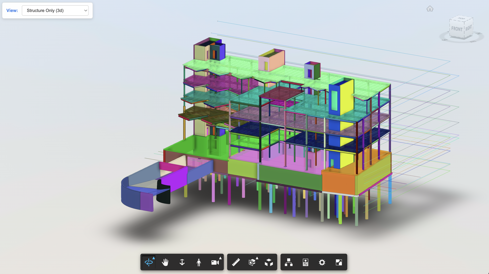

# APS Viewer SDK

Lightweight Python helper to render APS models in the browser.



## Features
- Display a Revit model in the APS Viewer.
- Dropdown of available views (switches 3D/2D scenes).
- Highlight/color elements by `externalId`.

## Use Cases
- QA/QC filtering.
- Pre-processing for automation APIs.
- Integrations with Model Properties API, Model Derivative, Data Exchange API, and AEC Data Model API.

## Install

Requires `uv` (install: https://docs.astral.sh/uv/).

```bash
uv sync
uv sync --group test
```

## Example: Open Viewer in Browser

```python
from aps_viewer_sdk import APSViewer
from aps_viewer_sdk.helper import get_2lo_token

token = get_2lo_token("CLIENT_ID", "CLIENT_SECRET")  # 2LO; 3LO tokens work too
viewer = APSViewer(
    urn="urn:...",  # ACC URNs work too
    token=token,
    views_selector=True,
)
viewer.show()
```

See `example/` for more:
- `example/color_elements_from_scene.ipynb` shows how to translate an input Revit file to SVF/SVF2 and produce a viewer-ready URN.
- The notebook also sketches highlighting elements with random colors after loading the view.
